[](https://pypi.org/project/geneticalgorithm2/)
[](https://pepy.tech/project/geneticalgorithm2)
[](https://pepy.tech/project/geneticalgorithm2)
[](https://pepy.tech/project/geneticalgorithm2)

[](https://gitter.im/geneticalgorithm2/community?utm_source=badge&utm_medium=badge&utm_campaign=pr-badge)
[](https://github.com/PasaOpasen/geneticalgorithm2/pulls)

https://pasaopasen.github.io/geneticalgorithm2/

**geneticalgorithm2** (from [DPEA](https://github.com/PasaOpasen/PasaOpasen.github.io/blob/master/EA_packages.md)) **is the supported advanced optimized fork of non-supported package** [geneticalgorithm](https://github.com/rmsolgi/geneticalgorithm) of *Ryan (Mohammad) Solgi*

- [About](#about)
- [Installation](#installation)
- [Updates information](#updates-information)
  - [**Future**](#future)
  - [**TODO firstly**](#todo-firstly)
  - [6.9.2 bugfixes](#692-bugfixes)
  - [6.9.1 refactor](#691-refactor)
  - [6.9.0 reborn](#690-reborn)
  - [6.8.7 minor update](#687-minor-update)
  - [6.8.6 minor update](#686-minor-update)
  - [6.8.5 minor update](#685-minor-update)
  - [6.8.4 minor update](#684-minor-update)
  - [6.8.3 types update](#683-types-update)
  - [6.8.2 patch](#682-patch)
  - [6.8.1 patch](#681-patch)
  - [6.8.0 minor update](#680-minor-update)
  - [6.7.7 refactor](#677-refactor)
  - [6.7.6 bug fix](#676-bug-fix)
  - [6.7.5 refactor](#675-refactor)
  - [6.7.4 bug fix](#674-bug-fix)
  - [6.7.3 speed up](#673-speed-up)
  - [6.7.2 little update](#672-little-update)
  - [6.7.1 patch](#671-patch)
  - [6.7.0 minor update (new features)](#670-minor-update-new-features)
  - [6.6.2 patch (speed up)](#662-patch-speed-up)
  - [6.6.1 patch](#661-patch)
  - [6.6.0 minor update (refactoring)](#660-minor-update-refactoring)
  - [6.5.1 patch](#651-patch)
  - [6.5.0 minor update (refactoring)](#650-minor-update-refactoring)
  - [6.4.1 patch (bug fix)](#641-patch-bug-fix)
  - [6.4.0 minor update (refactoring)](#640-minor-update-refactoring)
  - [6.3.0 minor update (refactoring)](#630-minor-update-refactoring)
- [Working process](#working-process)
  - [Main algorithm structure](#main-algorithm-structure)
  - [Optimization process components](#optimization-process-components)
    - [Function to minimize](#function-to-minimize)
    - [Optimization space](#optimization-space)
    - [Algorithm parameters](#algorithm-parameters)
    - [Samples constructors](#samples-constructors)
    - [Callbacks](#callbacks)
  - [How to run](#how-to-run)
  - [Constructor parameters](#constructor-parameters)
  - [Genetic algorithm's parameters](#genetic-algorithms-parameters)
    - [AlgorithmParams object](#algorithmparams-object)
    - [Parameters of algorithm](#parameters-of-algorithm)
      - [**Crossover**](#crossover)
      - [**Mutation**](#mutation)
      - [**Selection**](#selection)
  - [Methods and Properties of model](#methods-and-properties-of-model)
- [Examples for beginner](#examples-for-beginner)
  - [A minimal example](#a-minimal-example)
  - [The simple example with integer variables](#the-simple-example-with-integer-variables)
  - [The simple example with Boolean variables](#the-simple-example-with-boolean-variables)
  - [The simple example with mixed variables](#the-simple-example-with-mixed-variables)
  - [Optimization problems with constraints](#optimization-problems-with-constraints)
  - [Middle example: select fixed count of objects from set](#middle-example-select-fixed-count-of-objects-from-set)
- [U should know these features](#u-should-know-these-features)
  - [Available crossovers](#available-crossovers)
  - [Available selections](#available-selections)
  - [Function timeout](#function-timeout)
  - [Standard GA vs. Elitist GA](#standard-ga-vs-elitist-ga)
  - [Standard crossover vs. stud EA crossover](#standard-crossover-vs-stud-ea-crossover)
  - [Creating better start population](#creating-better-start-population)
    - [Select best N of kN](#select-best-n-of-kn)
    - [Do local optimization](#do-local-optimization)
    - [Optimization with oppositions](#optimization-with-oppositions)
  - [Revolutions](#revolutions)
  - [Duplicates removing](#duplicates-removing)
  - [Cache](#cache)
  - [Report checker](#report-checker)
  - [Middle callbacks](#middle-callbacks)
  - [How to compare efficiency of several versions of GA optimization](#how-to-compare-efficiency-of-several-versions-of-ga-optimization)
  - [Hints on how to adjust genetic algorithm's parameters (from `geneticalgorithm` package)](#hints-on-how-to-adjust-genetic-algorithms-parameters-from-geneticalgorithm-package)
  - [How to get maximum speed](#how-to-get-maximum-speed)
    - [Don't use plotting](#dont-use-plotting)
    - [Don't use progress bar](#dont-use-progress-bar)
    - [Try to use faster optimizing function](#try-to-use-faster-optimizing-function)
    - [Specify custom optimized `mutation`, `crossover`, `selection`](#specify-custom-optimized-mutation-crossover-selection)
    - [Specify `fill_children` method](#specify-fill_children-method)
- [Examples pretty collection](#examples-pretty-collection)
  - [Optimization test functions](#optimization-test-functions)
    - [Sphere](#sphere)
    - [Ackley](#ackley)
    - [AckleyTest](#ackleytest)
    - [Rosenbrock](#rosenbrock)
    - [Fletcher](#fletcher)
    - [Griewank](#griewank)
    - [Penalty2](#penalty2)
    - [Quartic](#quartic)
    - [Rastrigin](#rastrigin)
    - [SchwefelDouble](#schwefeldouble)
    - [SchwefelMax](#schwefelmax)
    - [SchwefelAbs](#schwefelabs)
    - [SchwefelSin](#schwefelsin)
    - [Stairs](#stairs)
    - [Abs](#abs)
    - [Michalewicz](#michalewicz)
    - [Scheffer](#scheffer)
    - [Eggholder](#eggholder)
    - [Weierstrass](#weierstrass)
  - [Using GA in reinforcement learning](#using-ga-in-reinforcement-learning)
  - [Using GA with image reconstruction by polygons](#using-ga-with-image-reconstruction-by-polygons)
- [Popular questions](#popular-questions)
  - [How to disable autoplot?](#how-to-disable-autoplot)
  - [How to plot population scores?](#how-to-plot-population-scores)
  - [How to specify evaluated function for all population?](#how-to-specify-evaluated-function-for-all-population)
  - [What about parallelism?](#what-about-parallelism)
  - [How to initialize start population? How to continue optimization with new run?](#how-to-initialize-start-population-how-to-continue-optimization-with-new-run)

# About

[**geneticalgorithm2**](https://pasaopasen.github.io/geneticalgorithm2/) is very flexible and highly optimized Python library for implementing classic
[genetic-algorithm](https://towardsdatascience.com/introduction-to-optimization-with-genetic-algorithm-2f5001d9964b) (GA).

Features of this package:

* written on **pure python**
* **extremely fast**
* **no hard dependencies** (only numpy primary)
* **easy to run**: no need to perform long task-setup process
* easy to logging, reach **support of flexible callbacks**
* **many built-in plotting functions**
* **many built-in cases of crossover, mutation and selection**
* support of integer, boolean and real (continuous/discrete) variables types
* support of mixed types of variables
* **support of classic, elitist and studEA genetic algorithm combinations**
* **support of revolutions and duplicates utilization**
* **reach support of customization**
    
# Installation

Install this package with standard light dependencies to use the base functional.
```
pip install geneticalgorithm2
```

Install this package with full dependencies to use all provided functional including plotting and built-in parallelism tools.

```
pip install geneticalgorithm2[full]
```

# Updates information

## **Future**

- duplicates removing and revolutions will be moved to `MiddleCallbacks` and removed as alone `run()` parameters
- new stop criteria callbacks (min std, max functions evaluations)
- `vartype` will support strings like `iiiiibbf`

## **TODO firstly**
- Remove old style mentions from README

## 6.9.2 bugfixes

## 6.9.1 refactor

- Finally move `function_timeout` and `function` to `run()` method and deprecate its usage in init()
- `function` is not mandatory to be non-empty 
- reduce documentation duplicates

## 6.9.0 reborn

- recreate the repository without excess heavy files materials 
- host the [code documentation](https://pasaopasen.github.io/geneticalgorithm2/)
- rename `geneticalgorithm2` class to `GeneticAlgorithm2`
- substantial package architecture refactor
- add more docstrings

## 6.8.7 minor update

- some code refactor
- fixes:
  - ensure the directory of generation file exists on save

## 6.8.6 minor update

- small package installation update: add `pip install geneticalgorithm2[full]` version
- small refactor

## 6.8.5 minor update

- update `OppOpPopInit` `2.0.0->2.0.1`
- set default `function_timeout` to `None` which means no use of function time checking
- remove `joblib` and `func_timeout` from necessary dependencies

## 6.8.4 minor update

- a bit of refactor
- little optimizations
- add empty field `fill_children(pop_matrix, parents_count)` to `geneticalgorithm2` class to specify children creating behavior (what is the most intensive part of algorithm after optimizing func calculations), see [this](#specify-fill_children-method)

## 6.8.3 types update

- much more type hints

## 6.8.2 patch

- for printing info
- fix logic: now population is always sorted before going to callbacks

## 6.8.1 patch

- printing progress bar to `'stderr'` or `'stdout'` or `None` (disable) by choice (`progress_bar_stream` argument of `run()`), deprecated `disable_progress_bar`
- little speed up
- new `geneticalgorithm2.vectorized_set_function` set function, which can be faster for big populations 

## 6.8.0 minor update

- remove `crossover_probability` model parameter because of it has no sense to exist (and 1.0 value is better than others, take a look at [results](/examples/output/sense_of_crossover_prob__no_sense.png)). This parameter came from `geneticalgorithm` old package and did`t change before.

## 6.7.7 refactor

- change some behavior about parents selection

## 6.7.6 bug fix

- fix some bug of `variable_type=='bool'`
- some refactor of progress bar
- add some dependencies to `setup.py`

## 6.7.5 refactor

- shorter progress bar (length can be controlled by setting `PROGRESS_BAR_LEN` field of `geneticalgorithm2` class)
- shorter logic of `run()`, more informative output 

## 6.7.4 bug fix

- bug fix

## 6.7.3 speed up

- refactor to make `run()` method faster

## 6.7.2 little update

- better flexible logic for report, [take a look](#report-checker)
- removed `show mean` parameter from `model.plot_result` and now model reports only best score by default, not average and so on (u can specify if u wanna report average too)
- `plot_several_lines` useful function

## 6.7.1 patch

- changes according to new [OppOpPopInit](https://github.com/PasaOpasen/opp-op-pop-init) version

## 6.7.0 minor update (new features)

- add `mutation_discrete_type` and `mutation_discrete_probability` parameters in model. It controls mutation behavior for discrete (integer) variables and works like `mutation_type` and `mutation_probability` work for continuous (real) variables. Take a look at [algorithm parameters](#parameters-of-algorithm) 

## 6.6.2 patch (speed up)

- fix and speed up mutation

## 6.6.1 patch

- removed unnecessary dependencies

## 6.6.0 minor update (refactoring)

- deprecated `variable_type_mixed`, now use `variable_type` for mixed optimization too
- deprecated `output_dict`, now it's better object with name `result`
- refactor of big part of **tests**
- refactor of README

## 6.5.1 patch

- replace `collections.Sequence` with `collections.abc.Sequence`, now it should work for `python3.10+`

## 6.5.0 minor update (refactoring)

- another form of data object using with middle callbacks (`MiddleCallbackData` dataclass instead of dictionary)
- type hints for callbacks module 

## 6.4.1 patch (bug fix)

- fix bug setting attribute to algorithm parameters (in middle callbacks) 


## 6.4.0 minor update (refactoring)

- new valid forms for `start_generation`; now it's valid to use
    * `None`
    * `str` path to saved generation
    * dictionary with structure `{'variables': variables/None, 'scores': scores/None}`
    * `Generation` object: `Generation(variables = variables, scores = scores)`
    * `np.ndarray` with shape `(samples, dim)` for only population or `(samples, dim+1)` for concatenated population and score (scores is the last matrix column)
    * `tuple(np.ndarray/None, np.ndarray/None)` for variables and scores
  
  here `variables` is 2D numpy array with shape `(samples, dim)`, `scores` is 1D numpy array with scores (function values) for each sample; [here](examples/output/start_gen.py) and [here](#how-to-initialize-start-population-how-to-continue-optimization-with-new-run) u can see examples of using these valid forms 


## 6.3.0 minor update (refactoring)

- type hints for entire part of functions
- new valid forms for function parameters (now u don't need to use numpy arrays everywhere)
- `AlgorithmParams` class for base GA algorithm parameters (instead of dictionary)
- `Generation` class for saving/loading/returning generation (instead of dictionary)

All that classes are collected [in file](geneticalgorithm2/data_types/classes.py). To maintain backward compatibility, `AlgorithmParams` and `Generation` classes have dictionary-like interface for getting fields: u can use `object.field` or `object['field']` notations.


# Working process

## Main algorithm structure

```
Pre-process: making inner functions depends on params, making/loading start population

while True:

    if reason to stop (time is elapsed / no progress / generation count is reached / min value is reached):
        break


    select parents to crossover from last population and put them to new population:
        select (elit count) best samples
        select (parents count - elit count) random samples (by selection function)

    create (total samples count - parents count) children (samples from selected parents) and put them to new population:
        while not all children are created:
            select 2 random parents
            make child1, child2 from them using crossover
            mutate child1 by mutation (model.mut)
            mutate child2 by middle mutation (model.mut_middle)
            put children to new population
    
    remove duplicates, make revolutions, sort population by scores
    use callbacks, use middle callbacks

Post-process: plotting results, saving

```

## Optimization process components

### Function to minimize

The goal of the optimization process is to find the *minimum* of the given `function (1D array) -> float` where the function argument is a vector of some values in different dimensions. 

If u want to find the *maximum*, use this idea:
```python
opt_func = lambda arr: -func(arr)

#
# ... find global min of opt_func
#

opt_minimum=opt_func(best value)
maximum = -opt_minimum
```

Also it is possible and highly recommended to create and use a *vectorized* version of this function called `set_function (2D array) -> (1D array)` which transforms several samples matrix to samples scores vector by one call. Using this way u can speed up calculations or set up more complex tasks optimization

### Optimization space

The function rates 1D arrays (vectors) where each component (dimension) means something u program it to mean. Each dimension has its `bound` (`[min; max]` cut) and `variable type` (real/discrete).

**Advice**. Genetic algorithms work much faster and efficient for discrete tasks. If high precision is not required u can split any real dimension to many discrete values (for instance, `[1.1, 1.2, 1.25, 1.44]`) and try to optimize indexes of the given array which are converted to real values inside `function` itself.

### Algorithm parameters

There are a number of hyperparameters u can probe to optimize including population size and selection/crossover/mutation types.

### Samples constructors

There are several ways to create new testing samples from zero when u start with empty population or when u need new samples after [duplicates removing](#duplicates-removing) and [revolutions](#revolutions). 


### Callbacks

Now the package supports 2 different types of highly customized callbacks:
* [simple callbacks](#callbacks)
* [middle callbacks](#middle-callbacks)

## How to run

Firstly, u should **import needed packages**. 

All available (but not always necessary) imports are:

```python
import numpy as np

# the only one required import
from geneticalgorithm2 import GeneticAlgorithm2 as ga  # for creating and running optimization model

from geneticalgorithm2 import Generation, AlgorithmParams  # classes for comfortable parameters setting and getting

from geneticalgorithm2 import Crossover, Mutations, Selection  # classes for specific mutation and crossover behavior

from geneticalgorithm2 import get_population_initializer  # for creating better start population

from geneticalgorithm2 import np_lru_cache  # for cache function (if u want)

from geneticalgorithm2 import plot_pop_scores  # for plotting population scores, if u want

from geneticalgorithm2 import Callbacks  # simple callbacks (will be deprecated)

from geneticalgorithm2 import Actions, ActionConditions, MiddleCallbacks  # middle callbacks
```

Next step: **define the function to minimize**:

```python
def function(X: np.ndarray) -> float: # X as 1d-numpy array
    return np.sum(X**2) + X.mean() + X.min() + X[0]*X[2] # some float result
```

Also u should **create the bounds for each variable** (if exist) such as:

```python
var_bound = np.array([[0,10]]*3) # 2D numpy array with shape (dim, 2)

# also u can use Sequence of Tuples (from version 6.3.0)
var_bound = [
    (0, 10),
    (0, 10),
    (0, 10)
]
```

**Important**. U don't need to use variable boundaries only if variable type of each variable is boolean. This case will be automatically converted to discrete variables with bounds `(0, 1)`.

After that u **create a `GeneticAlgorithm2` (was imported early as ga) object**:

```python
model = ga( 
    dimension = 3, 
    variable_type='real', 
    variable_boundaries = var_bound,
    algorithm_parameters={
        'max_num_iteration': None,
        'population_size':100,
        'mutation_probability': 0.1,
        'mutation_discrete_probability': None,
        'elit_ratio': 0.01,
        'parents_portion': 0.3,
        'crossover_type':'uniform',
        'mutation_type': 'uniform_by_center',
        'mutation_discrete_type': 'uniform_discrete',
        'selection_type': 'roulette',
        'max_iteration_without_improv':None
    }
)
```

**Note**: it is not mandatory to write all possible `algorithm_parameters`, here it is done only to show u defaults. Also u can use `AlgorithmParams` (with typehints and docstrings) class instead of dicts:

```python
algorithm_parameters=AlgorithmParams(
    max_num_iteration=None,
    population_size=100,
    mutation_probability=0.1,
    mutation_discrete_probability=None,
    elit_ratio=0.01,
    parents_portion=0.3,
    crossover_type='uniform',
    mutation_type='uniform_by_center',
    mutation_discrete_type='uniform_discrete',
    selection_type='roulette',
    max_iteration_without_improv=None
)
```

**Run the search method**:

```python
# all of this parameters are default
result = model.run(
    no_plot = False, 
    progress_bar_stream = 'stdout',
    disable_printing = False,

    function=function,
    function_timeout=None,

    set_function = None, 
    apply_function_to_parents = False, 
    start_generation = None,
    studEA = False,
    mutation_indexes = None,

    init_creator = None,
    init_oppositors = None,
    duplicates_oppositor = None,
    remove_duplicates_generation_step = None,
    revolution_oppositor = None,
    revolution_after_stagnation_step = None,
    revolution_part = 0.3,
    
    population_initializer = Population_initializer(select_best_of = 1, local_optimization_step = 'never', local_optimizer = None),
    
    stop_when_reached = None,
    callbacks = [],
    middle_callbacks = [],
    time_limit_secs = None, 
    save_last_generation_as = None,
    seed = None
)

# best candidate
print(result.variable)

# best score
print(result.score)

# last generation
print(result.last_generation)

```

## Constructor parameters

Have a look at https://pasaopasen.github.io/geneticalgorithm2/geneticalgorithm2/geneticalgorithm2.html#GeneticAlgorithm2.__init__

## Genetic algorithm's parameters

### AlgorithmParams object

The parameters of GA are defined as a dictionary or `AlgorithmParams` object: https://pasaopasen.github.io/geneticalgorithm2/geneticalgorithm2/data_types/algorithm_params.html

To get the global default params use code:
```python
params = ga.default_params
```

To get actual parameters of an existing model use code:
```python
params = model.param
```

### Parameters of algorithm

#### **Crossover**

https://pasaopasen.github.io/geneticalgorithm2/geneticalgorithm2/crossovers.html

#### **Mutation**

https://pasaopasen.github.io/geneticalgorithm2/geneticalgorithm2/mutations.html

#### **Selection**

https://pasaopasen.github.io/geneticalgorithm2/geneticalgorithm2/selections.html

## Methods and Properties of model

Have a look at https://pasaopasen.github.io/geneticalgorithm2/geneticalgorithm2/geneticalgorithm2.html#GeneticAlgorithm2.run

# Examples for beginner

## A minimal example 

Assume we want to find a set of `X = (x1, x2, x3)` that minimizes function `f(X) = x1 + x2 + x3` where `X` can be any real number in `[0, 10]`.

This is a trivial problem and we already know that the answer is `X = (0, 0, 0)` where `f(X) = 0`.  

We just use this simple example to show how to implement it with `geneticalgorithm2`. First we import `geneticalgorithm2` and [numpy](https://numpy.org). Next, we define 
function `f` which we want to minimize and the boundaries of the decision variables. Then simply `geneticalgorithm2` is called to solve the defined optimization problem as follows:

```python
import numpy as np
from geneticalgorithm2 import GeneticAlgorithm2 as ga


def f(X):
    return np.sum(X)


varbound = [[0, 10]] * 3

model = ga(dimension=3, variable_type='real', variable_boundaries=varbound)

model.run(function=f)
```
  
If you run the code, you should see a progress bar that shows the progress of the 
genetic algorithm (GA) and then the solution, objective function value and the convergence curve as follows:


Also we can access to the best answer of the defined optimization problem found by GA as a dictionary and a report of the progress of the genetic algorithm. 
To do so we complete the code as follows:

```python
convergence = model.report

solution = model.result
```

## The simple example with integer variables

Considering the problem given in the simple example above.
Now assume all variables are integers. So `x1, x2, x3` can be any integers in `[0, 10]`.
In this case the code is as the following:

```python
import numpy as np
from geneticalgorithm2 import GeneticAlgorithm2 as ga


def f(X):
    return np.sum(X)

varbound = [[0, 10]] * 3

model = ga(dimension=3, variable_type='int', variable_boundaries=varbound)

model.run(function=f)
```
So, as it is seen the only difference is that for `variable_type` we use string `'int'`. 

## The simple example with Boolean variables

Considering the problem given in the simple example above.
Now assume all variables are boolean instead of real or integer. So `X` can be either zero or one. Also instead of three let's have 30 variables.
In this case the code is as the following:

```python
import numpy as np
from geneticalgorithm2 import GeneticAlgorithm2 as ga


def f(X):
    return np.sum(X)

model = ga(dimension=30, variable_type='bool')

model.run(function=f)
```
Note for variable_type we use string `'bool'` when all variables are boolean.  
Note that when variable_type equal `'bool'` there is no need for `variable_boundaries` to be defined.

## The simple example with mixed variables

Considering the problem given in the the simple example above where we want to minimize `f(X) = x1 + x2 + x3`. 
Now assume `x1` is a real (continuous) variable in `[0.5; 1.5]`, `x2` is an integer variable in `[1;100]`, and `x3` is a boolean variable that can be either zero or one.
We already know that the answer is `X = (0.5, 1, 0)` where `f(X) = 1.5`.
We implement geneticalgorithm2 as the following:

```python
import numpy as np
from geneticalgorithm2 import GeneticAlgorithm2 as ga


def f(X):
    return np.sum(X)


varbound = [[0.5, 1.5], [1, 100], [0, 1]]
vartype = ('real', 'int', 'int')
model = ga(dimension=3, variable_type=vartype, variable_boundaries=varbound)

model.run(function=f)
```

## Optimization problems with constraints

In all above examples, the optimization problem was unconstrained. Now consider that we want to minimize `f(X) = x1+x2+x3` where `X` is a set of real variables in `[0; 10]`. Also we have an extra constraint so that sum of `x1` and `x2` is equal or greater than 2. The minimum of `f(X)` is 2.
In such a case, a trick is to define penalty function. Hence we use the code below:

```python
import numpy as np
from geneticalgorithm2 import GeneticAlgorithm2 as ga


def f(X):
    pen = 0
    if X[0] + X[1] < 2:
        pen = 500 + 1000 * (2 - X[0] - X[1])
    return np.sum(X) + pen


varbound = [[0, 10]] * 3

model = ga(dimension=3, variable_type='real', variable_boundaries=varbound)

model.run(function=f)

```
As seen above we add a penalty to the objective function whenever the constraint is not met.  

Some hints about how to define a penalty function:  

1. Usually you may use a constant greater than the maximum possible value of the objective function if the maximum is known or if we have a guess of that. Here the highest possible value of our function is 300 (i.e. if all variables were 10, `f(X)=300`). So I chose a constant of 500. So, if a trial solution is not in the feasible region even though its objective function may be small, the penalized objective function (fitness function) is worse than any feasible solution.
2. Use a coefficient big enough and multiply that by the amount of violation. This helps the algorithm learn how to approach feasible domain.
3. How to define penalty function usually influences the convergence rate of an evolutionary algorithm. In my [book on metaheuristics and evolutionary algorithms](https://www.wiley.com/en-us/Meta+heuristic+and+Evolutionary+Algorithms+for+Engineering+Optimization-p-9781119386995) you can learn more about that. 
4. Finally after you solved the problem test the solution to see if boundaries are met. If the solution does not meet constraints, it shows that a bigger penalty is required. However, in problems where optimum is exactly on the boundary of the feasible region (or very close to the constraints) which is common in some kinds of problems, a very strict and big penalty may prevent the genetic algorithm to approach the optimal region. In such a case designing an appropriate penalty function might be more challenging. Actually what we have to do is to design a penalty function that let the algorithm searches unfeasible domain while finally converge to a feasible solution. Hence you may need more sophisticated penalty functions. But in most cases the above formulation work fairly well.

## Middle example: select fixed count of objects from set

For some task u need to think a lot and create good specific crossover or mutation functions. For example, take a look at this problem:
```
    From set like X = {x1, x2, x3, ..., xn} u should select only k objects which get the best function value
```
U can do it using this code:

```python
import numpy as np
from geneticalgorithm2 import GeneticAlgorithm2 as ga

subset_size = 20  # how many objects we can choose

objects_count = 100  # how many objects are in set

my_set = np.random.random(objects_count) * 10 - 5  # set values


# minimized function
def f(X):
    return abs(np.mean(my_set[X == 1]) - np.median(my_set[X == 1]))


# initialize start generation and params

N = 1000  # size of population
start_generation = np.zeros((N, objects_count))
indexes = np.arange(0, objects_count, dtype=np.int8)  # indexes of variables

for i in range(N):
    inds = np.random.choice(indexes, subset_size, replace=False)
    start_generation[i, inds] = 1


def my_crossover(parent_a, parent_b):
    a_indexes = set(indexes[parent_a == 1])
    b_indexes = set(indexes[parent_b == 1])

    intersect = a_indexes.intersection(b_indexes)  # elements in both parents
    a_only = a_indexes - intersect  # elements only in 'a' parent
    b_only = b_indexes - intersect

    child_inds = np.array(list(a_only) + list(b_only), dtype=np.int8)
    np.random.shuffle(child_inds)  # mix

    children = np.zeros((2, parent_a.size))
    if intersect:
        children[:, np.array(list(intersect))] = 1
    children[0, child_inds[:int(child_inds.size / 2)]] = 1
    children[1, child_inds[int(child_inds.size / 2):]] = 1

    return children[0, :], children[1, :]


model = ga(
    dimension=objects_count,
    variable_type='bool',
    algorithm_parameters={
        'max_num_iteration': 500,
        'mutation_probability': 0,  # no mutation, just crossover
        'elit_ratio': 0.05,
        'parents_portion': 0.3,
        'crossover_type': my_crossover,
        'max_iteration_without_improv': 20
    }
)

model.run(
    function=f,
    no_plot=False, 
    start_generation=(start_generation, None)
)
```

# U should know these features

## Available crossovers

For two example parents (*one with ones* and *one with zeros*) next crossovers will give same children ([examples](examples/crossovers_examples.py)): 

* **one_point**:

|0 | 0 | 0 | 0 | 0 | 0 | 0 | 0 | 1 | 1 | 1 | 1 | 1 | 1 | 1|
|:---: | :---: | :---: | :---: | :---: | :---: | :---: | :---: | :---: | :---: | :---: | :---: | :---: | :---: | :---:|
|1 | 1 | 1 | 1 | 1 | 1 | 1 | 1 | 0 | 0 | 0 | 0 | 0 | 0 | 0|

* **two_point**:

|1 | 1 | 0 | 0 | 0 | 0 | 0 | 0 | 0 | 0 | 0 | 0 | 1 | 1 | 1|
|:---: | :---: | :---: | :---: | :---: | :---: | :---: | :---: | :---: | :---: | :---: | :---: | :---: | :---: | :---:|
|0 | 0 | 1 | 1 | 1 | 1 | 1 | 1 | 1 | 1 | 1 | 1 | 0 | 0 | 0|

* **uniform**:

|1 | 1 | 1 | 0 | 1 | 1 | 0 | 0 | 0 | 0 | 0 | 1 | 0 | 0 | 0|
|:---: | :---: | :---: | :---: | :---: | :---: | :---: | :---: | :---: | :---: | :---: | :---: | :---: | :---: | :---:|
|0 | 0 | 0 | 1 | 0 | 0 | 1 | 1 | 1 | 1 | 1 | 0 | 1 | 1 | 1|

* **uniform_window**:

|1 | 1 | 1 | 1 | 1 | 1 | 1 | 1 | 1 | 0 | 0 | 0 | 1 | 1 | 1|
|:---: | :---: | :---: | :---: | :---: | :---: | :---: | :---: | :---: | :---: | :---: | :---: | :---: | :---: | :---:|
|0 | 0 | 0 | 0 | 0 | 0 | 0 | 0 | 0 | 1 | 1 | 1 | 0 | 0 | 0|

* **shuffle**:

|0 | 0 | 0 | 1 | 1 | 1 | 1 | 0 | 0 | 1 | 1 | 1 | 0 | 1 | 0|
|:---: | :---: | :---: | :---: | :---: | :---: | :---: | :---: | :---: | :---: | :---: | :---: | :---: | :---: | :---:|
|1 | 1 | 1 | 0 | 0 | 0 | 0 | 1 | 1 | 0 | 0 | 0 | 1 | 0 | 1|

* **segment**:

|0 | 1 | 1 | 0 | 0 | 1 | 0 | 1 | 0 | 0 | 1 | 0 | 0 | 1 | 1|
|:---: | :---: | :---: | :---: | :---: | :---: | :---: | :---: | :---: | :---: | :---: | :---: | :---: | :---: | :---:|
|1 | 0 | 0 | 1 | 1 | 0 | 1 | 0 | 1 | 1 | 0 | 1 | 1 | 0 | 0|

* **arithmetic**:

|0.13 | 0.13 | 0.13 | 0.13 | 0.13 | 0.13 | 0.13 | 0.13 | 0.13 | 0.13 | 0.13 | 0.13 | 0.13 | 0.13 | 0.13|
|:---: | :---: | :---: | :---: | :---: | :---: | :---: | :---: | :---: | :---: | :---: | :---: | :---: | :---: | :---:|
|0.87 | 0.87 | 0.87 | 0.87 | 0.87 | 0.87 | 0.87 | 0.87 | 0.87 | 0.87 | 0.87 | 0.87 | 0.87 | 0.87 | 0.87|

* **mixed**:

|0.63 | 0.84 | 1.1 | 0.73 | 0.67 | -0.19 | 0.3 | 0.72 | -0.18 | 0.61 | 0.84 | 1.14 | 1.36 | -0.37 | -0.19|
|:---: | :---: | :---: | :---: | :---: | :---: | :---: | :---: | :---: | :---: | :---: | :---: | :---: | :---: | :---:|
|0.51 | 0.58 | 0.43 | 0.42 | 0.55 | 0.49 | 0.57 | 0.48 | 0.46 | 0.56 | 0.56 | 0.54 | 0.44 | 0.51 | 0.4|

## Available selections

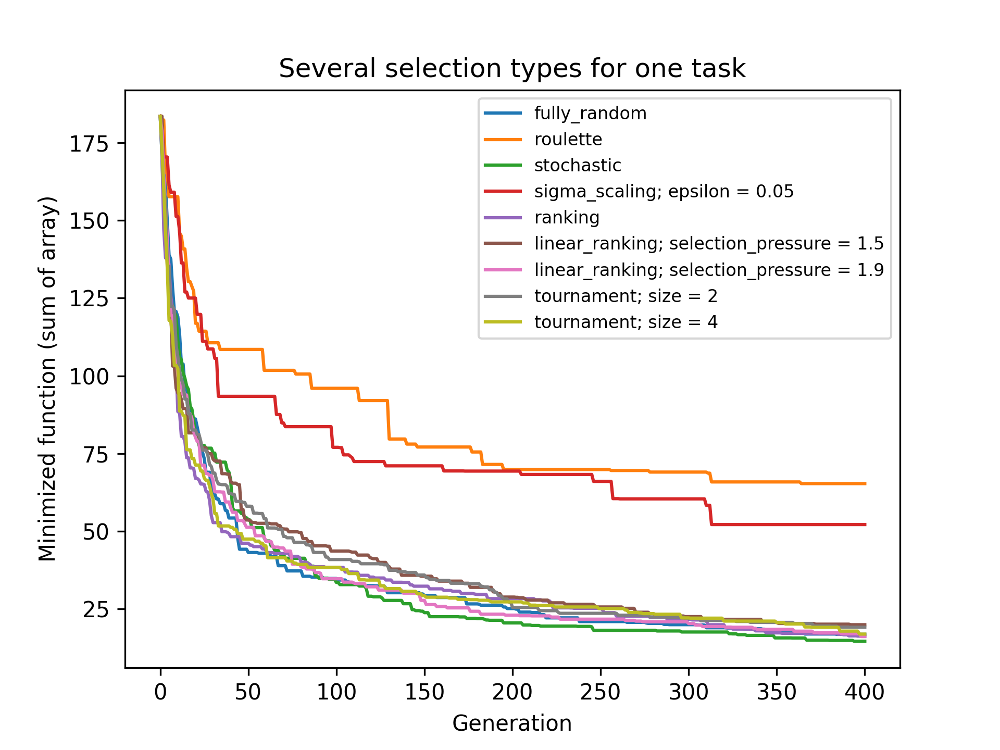


## Function timeout

**geneticalgorithm2** inherited several features from `geneticalgorithm` package sush as that if the given function does not provide any output before timeout, the algorithm would be terminated and raise the appropriate error. 

In such a case make sure the given function works correctly (i.e. there is no infinite loop in the given function). Also if the given function takes more than 10 seconds to complete the work
make sure to increase `function_timeout` in arguments.

## Standard GA vs. Elitist GA

The convergence curve of an elitist genetic algorithm is always non-increasing. So, the best ever found solution is equal to the best solution of the last iteration. However, the convergence curve of a standard genetic algorithm is different. If `elit_ratio` is zero geneticalgorithm2 implements a standard GA. The output of geneticalgorithm2 for standard GA is the best ever found solution not the solution of the last iteration. The difference between the convergence curve of standard GA and elitist GA is shown below:

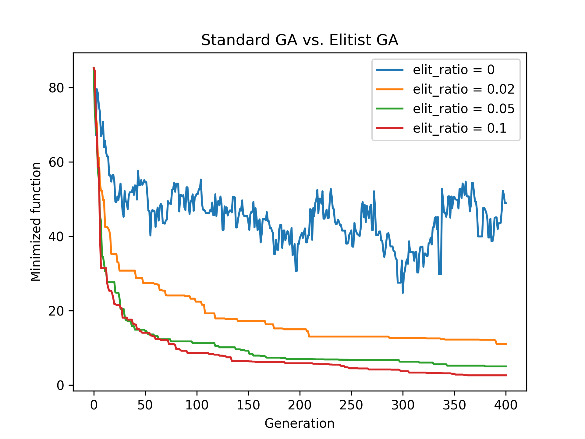

## Standard crossover vs. stud EA crossover

[Stud EA](https://link.springer.com/chapter/10.1007%2FBFb0056910) is the idea of using crossover always with best object. So one of two parents is always the best object of population. It can help us in a lot of tasks!

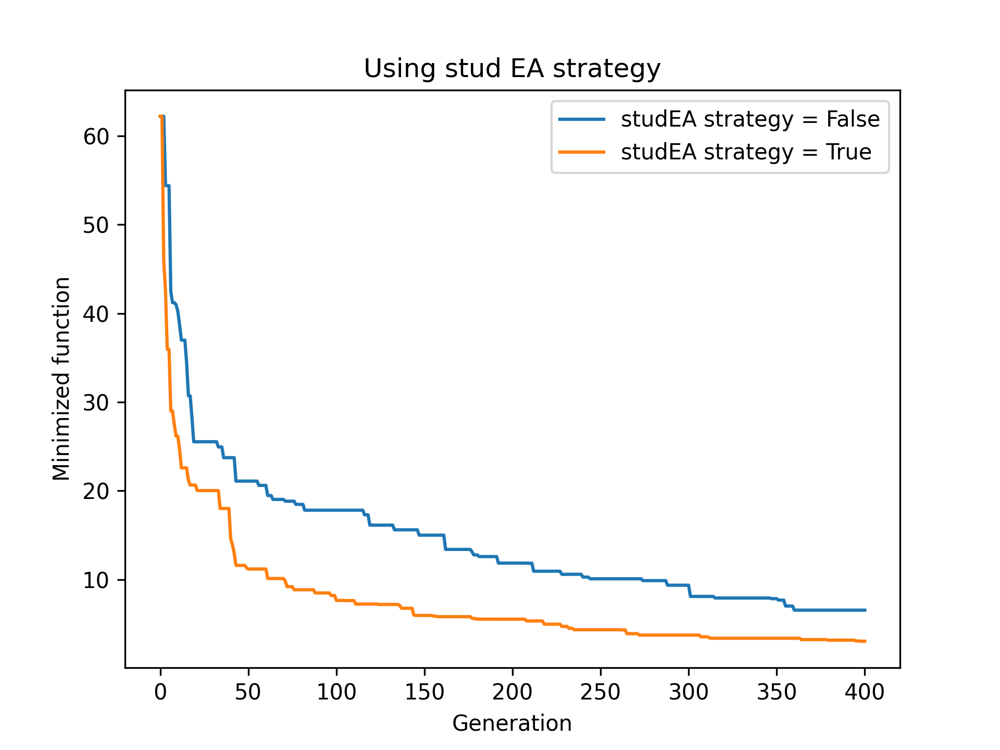

## Creating better start population

There is `get_population_initializer(select_best_of = 4, local_optimization_step = 'never', local_optimizer = None)` function for creating start population creators. Take a look at [its docs](https://pasaopasen.github.io/geneticalgorithm2/geneticalgorithm2/population_initializer.html)

### Select best N of kN

This little option can help u especially with multimodal tasks. 

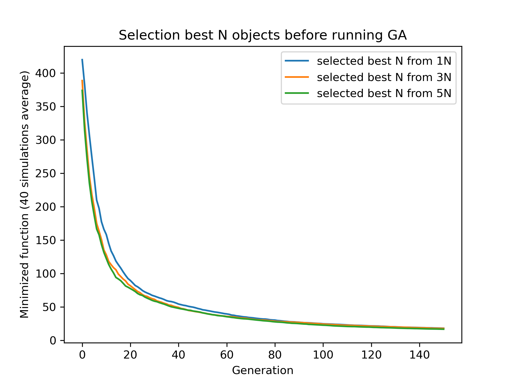

### Do local optimization

We can apply some local optimization on start generation before starting GA search. It can be some gradient descent or hill climbing and so on. Also we can apply it before selection best objects (on entire population) or after (on best part of population) and so forth.

In next example I'm using my [DiscreteHillClimbing](https://github.com/PasaOpasen/DiscreteHillClimbing) algorithm for local optimization my discrete task:

```python
import numpy as np
import matplotlib.pyplot as plt

from DiscreteHillClimbing import Hill_Climbing_descent

from geneticalgorithm2 import GeneticAlgorithm2 as ga
from geneticalgorithm2 import get_population_initializer


def f(arr):
    arr2 = arr / 25
    return -np.sum(arr2 * np.sin(np.sqrt(np.abs(arr2)))) ** 5 + np.sum(np.abs(arr2)) ** 2


iterations = 100

varbound = [[-100, 100]] * 15

available_values = [np.arange(-100, 101)] * 15

my_local_optimizer = lambda arr, score: Hill_Climbing_descent(
    function=f, available_predictors_values=available_values,
    max_function_evals=50, start_solution=arr
)

model = ga(
    dimension=varbound.shape[0],
    variable_type='int',
    variable_boundaries=varbound,
    algorithm_parameters={
        'max_num_iteration': iterations,
        'population_size': 400
    }
)

for time in ('before_select', 'after_select', 'never'):
    model.run(
        function=f
        no_plot=True,
        population_initializer=get_population_initializer(
            select_best_of=3,
            local_optimization_step=time,
            local_optimizer=my_local_optimizer
        )
    )

    plt.plot(model.report, label=f"local optimization time = '{time}'")

plt.xlabel('Generation')
plt.ylabel('Minimized function (40 simulations average)')
plt.title('Selection best N object before running GA')
plt.legend()
```

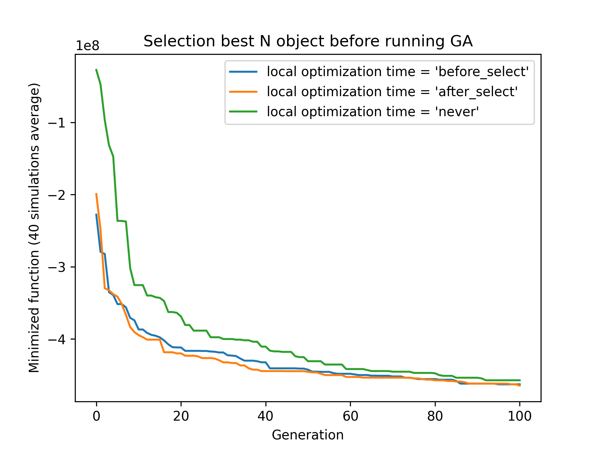

### Optimization with oppositions

Also u can create start population with [oppositions](https://github.com/PasaOpasen/opp-op-pop-init). See [example of code](examples/best_of_N_with_opp.py)

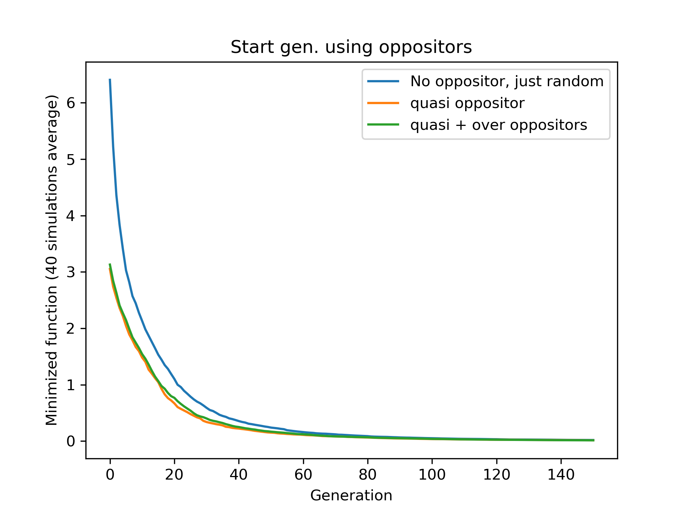

## Revolutions

U can create [revolutions in your population](https://github.com/PasaOpasen/opp-op-pop-init) after some stagnation steps. It really can help u for some tasks. See [example](examples/revolution.py)

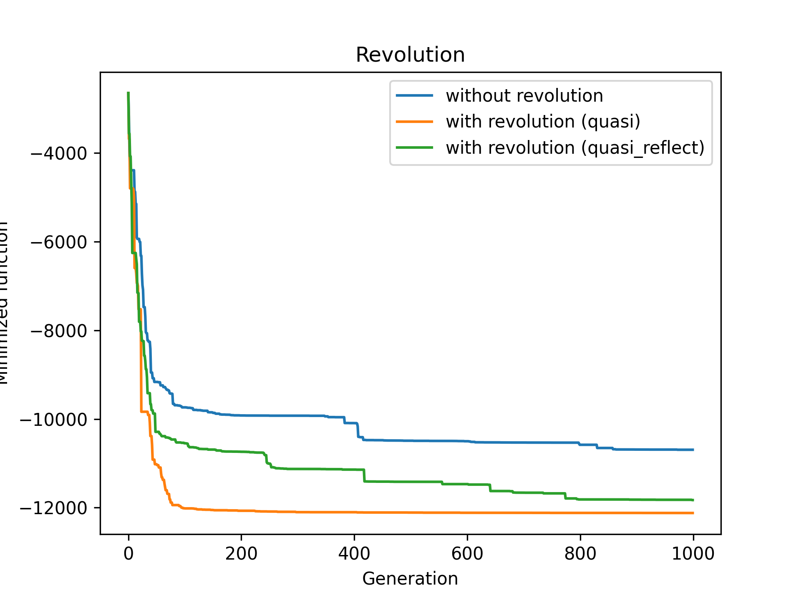


## Duplicates removing

If u remove duplicates each `k` generations, u can speed up the optimization process ([example](examples/remove_dups.py))

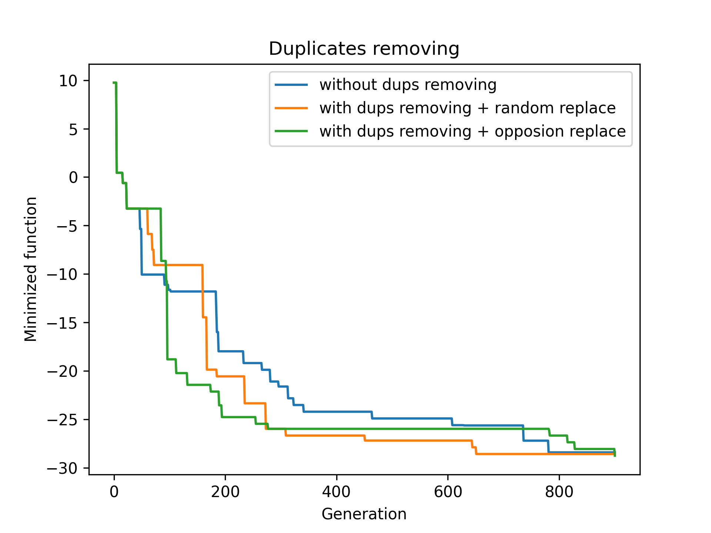

## Cache

It can be useful for run-speed to use cache with *some discrete tasks*. For this u can import `np_lru_cache` decorator and use it like here:

```python
import np_lru_cache

@np_lru_cache(maxsize=some_size)
def minimized_func(arr):
    # code
    return result

#
# run
#    algorithm
#


# don't forget to clear cache
minimized_func.cache_clear()
```
## Report checker

Basically the model checks best population score (minimal score of generation) each generation and saves it to `report` field. Actually this sequence of numbers u see in big part of plots. This behavior is needed for several parts and u cannot disable it. But if u want to report some other metric without using [callbacks](#middle-callbacks), there is highly simple and fast way.

After creating `model` but before running `run()` u need to append ur logic to `model.checked_reports` field. Take a look at example:

```python
import numpy as np

from geneticalgorithm2 import GeneticAlgorithm2 as ga
from geneticalgorithm2 import plot_several_lines


def f(X):
    return 50 * np.sum(X) - np.sum(np.sqrt(X) * np.sin(X))


dim = 25
varbound = [[0, 10]] * dim

model = ga(
    dimension=dim,
    variable_type='real', 
    variable_boundaries=varbound,
    algorithm_parameters={
        'max_num_iteration': 600
    }
)

# here model exists and has checked_reports field
# now u can append any functions to report

model.checked_reports.extend(
    [
        ('report_average', np.mean),
        ('report_25', lambda arr: np.quantile(arr, 0.25)),
        ('report_50', np.median)
    ]
)

# run optimization process
model.run(
    function=f,
    no_plot=False
)

# now u have not only model.report but model.report_25 and so on

# plot reports
names = [name for name, _ in model.checked_reports[::-1]]
plot_several_lines(
    lines=[getattr(model, name) for name in names],
    colors=('green', 'black', 'red', 'blue'),
    labels=['median value', '25% quantile', 'mean of population', 'best pop score'],
    linewidths=(1, 1.5, 1, 2),
    title="Several custom reports with base reports",
    save_as='./output/report.png'
)
```

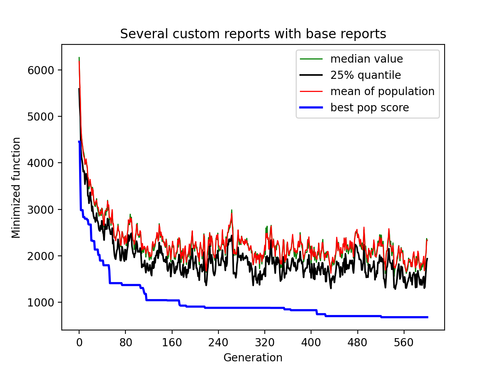

As u see, u should append tuple `(name of report, func to evaluate report)` to `model.checked_report`. It's highly recommended to start this name with `report_` (e. g. `report_my_median`). And the function u use will get 1D-numpy *sorted* array of population scores.


## Middle callbacks

There is an amazing way to control optimization process using `MiddleCallbacks` class. Just learn next logic:

1. u can use several `MiddleCallbacks` callbacks as list at `middle_callbacks` parameter in `run()` method
2. each middle callback is the pair of `action` and `condition` functions
3. `condition(data)` (`Callable[[MiddleCallbackData], bool]`) function gets `data` object (dataclass `MiddleCallbackData` from version 6.5.0) about primary model parameters and makes logical decision about applying `action` function
4. `action(data)` (`Callable[[MiddleCallbackData],MiddleCallbackData]`) function modifies `data` objects as u need -- and model will be modified by new `data`
5. `data` object is the structure with several parameters u can modify:
   ```python
    data = MiddleCallbackData(
        last_generation=Generation.from_pop_matrix(pop),
        current_generation=t,
        report_list=self.report,

        mutation_prob=self.prob_mut,
        crossover_prob=self.prob_cross,
        mutation=self.real_mutation,
        crossover=self.crossover,
        selection=self.selection,

        current_stagnation=counter,
        max_stagnation=self.max_stagnations,

        parents_portion=self.param.parents_portion,
        elit_ratio=self.param.elit_ratio,

        set_function=self.set_function
    )
   ```  
   So, the `action` function gets `data` objects and returns `data` object.

It's very simple to create your own `action` and `condition` functions. But there are several popular functions contained in `Actions` and `ActionConditions` classes:
* `actions`:
  * `Stop()` -- just stop optimization process
  * `ReduceMutationProb(reduce_coef = 0.9)` -- reduce mutation probability
  * `ChangeRandomCrossover(available_crossovers: Sequence[Callable[[np.ndarray, np.ndarray], Tuple[np.ndarray, np.ndarray]]])` -- change another (random) crossover from list of crossovers
  * `ChangeRandomSelection(available_selections: Sequence[Callable[[np.ndarray, int], np.ndarray]])`
  * `ChangeRandomMutation(available_mutations: Sequence[Callable[[float, float, float], float]])`
  * `RemoveDuplicates(oppositor = None, creator = None, converter = None)`; see [doc](geneticalgorithm2/callbacks/middle.py)
  * `CopyBest(by_indexes)` -- copies best population object values (from dimensions in `by_indexes`) to all population
  * `PlotPopulationScores(title_pattern = lambda data: f"Generation {data['current_generation']}", save_as_name_pattern = None)` -- plot population scores; needs 2 functions like `data`->string for title and file name (to save)
* `conditions`:
  * `ActionConditions.EachGen(generation_step = 10)` -- do action each `generation_step` generations
  * `ActionConditions.Always()` do action each generations, equals to `ActionConditions.EachGen(1)`
  * `ActionConditions.AfterStagnation(stagnation_generations = 50)` -- do action after `stagnation_generations` stagnation generations
  * `ActionConditions.Several(list_of_conditions)` -- do action if all conditions in list are true

To combine `action` and `condition` to callback, just use `MiddleCallbacks.UniversalCallback(action, condition)` methods.


There are also next high-level useful callbacks:

* `MiddleCallbacks.ReduceMutationGen(reduce_coef = 0.9, min_mutation = 0.005, reduce_each_generation = 50, reload_each_generation = 500)`
* `MiddleCallbacks.GeneDiversityStats(step_generations_for_plotting:int = 10)` -- plots some duplicates statistics each gen ([example](/examples/plot_diversities.py))
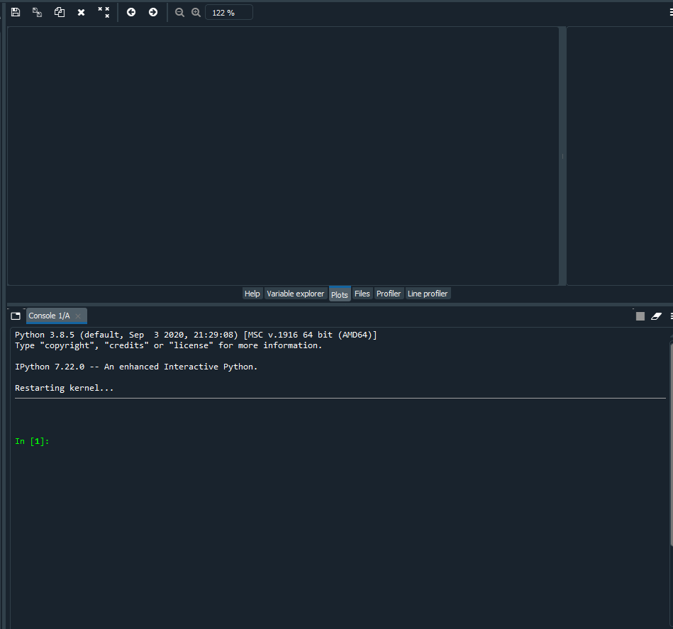


See [code example](examples/small_middle_callbacks.py)

## How to compare efficiency of several versions of GA optimization

To compare efficiency of several versions of GA optimization (such as several values of several hyperparameters or including/excepting some actions like oppositions) u should make some count of simulations and compare results using some statistical test. I have realized this logic [here](https://github.com/PasaOpasen/ab-testing-results-difference) 

## Hints on how to adjust genetic algorithm's parameters (from `geneticalgorithm` package)

In general the performance of a genetic algorithm or any evolutionary algorithm
depends on its parameters. Parameter setting of an evolutionary algorithm is important. Usually these parameters are adjusted based on experience and by conducting a sensitivity analysis.
It is impossible to provide a general guideline to parameter setting but the suggestions provided below may help:  

* **Number of iterations**: Select a `max_num_iterations` sufficiently large; otherwise the reported solution may not be satisfactory. On the other hand 
selecting a very large number of iterations increases the run time significantly. So this is actually a compromise between
the accuracy you want and the time and computational cost you spend. 

* **Population size**: Given a constant number of functional evaluations (`max_num_iterations` times population_size) I would select smaller population size and greater iterations. However, a very small choice of population size is also deteriorative. For most problems I would select a population size of 100 unless the dimension of the problem is very large that needs a bigger population size.

* **elit_ratio**: Although having few elites is usually a good idea and may increase the rate of convergence in some problems, having too many elites in the population may cause the algorithm to easily trap in a local optima. I would usually select only one elite in most cases. Elitism is not always necessary and in some problems may even be deteriorative.

* **mutation_probability**: This is a parameter you may need to adjust more than the other ones. Its appropriate value heavily depends on the problem. Sometimes we may select
mutation_probability as small as 0.01 (i.e. 1 percent) and sometimes even as large as 0.5 (i.e. 50 percent) or even larger. In general if the genetic algorithm trapped 
in a local optimum increasing the mutation probability may help. On the other hand if the algorithm suffers from stagnation reducing the mutation probability may be effective. However, this rule of thumb is not always true.

* **parents_portion**: If parents_portion set zero, it means that the whole of the population is filled with the newly generated solutions. 
On the other hand having this parameter equals 1 (i.e. 100 percent) means no new solution
is generated and the algorithm would just repeat the previous values without any change which is not meaningful and effective obviously. Anything between these two may work. The exact value depends on the problem.

* **crossover_type**: Depends on the problem. I would usually use uniform crossover. But testing the other ones in your problem is recommended.

* **max_iteration_without_improv**: This is a parameter that I recommend being used cautiously. 
If this parameter is too small then the algorithm may stop while it trapped in a local optimum.
So make sure you select a sufficiently large criteria to provide enough time for the algorithm to progress and to avoid immature convergence. 

Finally to make sure that the parameter setting is fine, we usually should run the 
algorithm for several times and if convergence curves of all runs converged to the same objective function value we may accept that solution as the optimum. The number of runs
depends but usually five or ten runs is prevalent. Notice that in some problems
several possible set of variables produces the same objective function value. 
When we study the convergence of a genetic algorithm we compare the objective function values not the decision variables.

## How to get maximum speed

### Don't use plotting

```python
result = model.run(
    no_plot = True, 
)
```

### Don't use progress bar

```python
result = model.run(
    progress_bar_stream = None,
)
```

### Try to use faster optimizing function

Try to speed up your optimizing `function` using Numpy, [Numba](https://numba.pydata.org/) or [Cython](https://cython.org/). If u can, write your own `set_function` (function which applies to whole population samples matrix) with cython optimizations, parallelism and so.

### Specify custom optimized `mutation`, `crossover`, `selection`

Write faster implementations for model methods `mut`, `mut_middle`, `crossover`, `selection` and set them before running optimization process:

```python
model.mut = custom_mut
model.crossover = custom_crossover

model.run(...)
```

### Specify `fill_children` method

From version `6.8.4` there is `fill_children` model method:

```python
self.fill_children: Optional[Callable[[array2D, int], None]] = None
```

It is empty and does nothing; but if u specify it, u can get huge speed up at very intensive algorithm part. Take a look at [main algo structure](#main-algorithm-structure). There is a part with creating children from parents, this part is the most intensive because it uses python loops, calls sampling, crossover and mutations at each iteration. Using `fill_children`, u can rewrite this logic in your manner to speed up.

Suppose u have new population matrix `pop` (type `np.float64`, shape `(population_size, dim_count)`) where first `parents_count` rows are selected parents, next rows are filled by random, so inside `fill_children` method u should fill last `population_size - parents_count` rows (children) by using some your logic. Expected (but not mandatory) logic like this:

```python
for k in range(self.parents_count, self.population_size, 2):

    r1, r2 = get_parents_inds()  # get 2 random parents indexes from [0, parents_count)

    pvar1 = pop[r1]
    pvar2 = pop[r2]

    ch1, ch2 = self.crossover(pvar1, pvar2)  # crossover

    # mutations
    ch1 = self.mut(ch1)
    ch2 = self.mut_middle(ch2, pvar1, pvar2)

    # put to population
    pop[k] = ch1
    pop[k+1] = ch2
```

**Example**. In one task I use this algorithm many times (100 000 generations total), so the speed matters. Every sample item is the index of element in other array there, so `i`th sample element is always integer value from cut `[0, end[i]]`. I use uniform crossover and uniform mutation (work perfect for this task). So I specified creating children logic for this task using cython.

Content of file `fill_children.pyx`:

```cython
#!python
#cython: language_level=3

import numpy as np

cimport numpy as np

np.import_array()

cimport cython

import math
import random

@cython.boundscheck(False)
@cython.wraparound(False)
def fill_children(
    np.ndarray[np.float64_t, ndim=2] pop,  # samples are integers but always float64 type
    int parents_count, # count of already done parents

    float mut_prob,  # mutation probability
    np.ndarray[np.uint8_t, ndim=1] ends  # max elements for each dimension (min elements are 0)
):

    cdef:
        Py_ssize_t i, k, population_size = pop.shape[0], dim_count = pop.shape[1], r1, r2

        float v1, v2, tmp
        np.ndarray[np.float64_t, ndim=1] cross, mut, mut_middle

    # making 2 children at each iteration
    for k in range(parents_count, population_size, 2): # C loop, not Python
        
        #
        # 2 random parents (fast implementation)
        #

        r1 = random.randrange(parents_count)
        r2 = random.randrange(parents_count)
        if r1 == r2:
            while r1 == r2:  # C loop!
               r2 = random.randrange(parents_count) 

        #
        # I always need these 3 random probs sequences, so the fastest way to obtain them is np.random.random
        #
        cross = np.random.random(dim_count)  # crossover probabilities for each dimension
        mut = np.random.random(dim_count)
        mut_middle = np.random.random(dim_count)

        for i in range(dim_count):  # C loop for each dimension
            v1 = pop[r1, i]  # first parent value
            v2 = pop[r2, i]  # second parent value

            if cross[i] < 0.5:  # random swap (uniform crossover), copy otherwise
                tmp = v2
                v2 = v1
                v1 = tmp

            if mut[i] < mut_prob:  # random mutation for first child
                # fastest way to get random integer from [0, ends[i]]
                # random.random() calls not always but only on mut[i] < mut_prob
                v1 = math.floor(random.random() * (ends[i] + 1))

            if mut_middle[i] < mut_prob: # mut_middle for second
                tmp = random.random()
                if v1 < v2:
                    v2 = v1 + math.floor(tmp * (v2 - v1 + 1))  # integer from [v1, v2], v1 < v2
                elif v1 > v2:
                    v2 = v2 + math.floor(tmp * (v1 - v2 + 1)) # integer from [v2, v1], v2 < v1
                else:
                    v2 = math.floor(tmp * (ends[i] + 1))

            #
            # put values to children in array
            #
            pop[k, i] = v1
            pop[k + 1, i] = v2

```

After compilation this file I can call it from python file to use inside GA:

```python

mut_prob = param['mutation_probability']

def fill_children(pop: array2D, parents_count: int):
    """wrapper on fill_children.fill_children with putting local variables mut_prob, ends"""
    return fill_children.fill_children(
        pop, parents_count, mut_prob, ends
    )

model.fill_children = fill_children

model.run(...)
```


# Examples pretty collection

## Optimization test functions

Here there is the implementation of `geneticalgorithm2` for some benchmark problems. Test functions are got from my [`OptimizationTestFunctions`](https://github.com/PasaOpasen/OptimizationTestFunctions) package. 

The code for optimizations process is same for each function and is contained [in file](examples/optimization_test_functions.py).

### [Sphere](https://github.com/PasaOpasen/OptimizationTestFunctions#sphere)


### [Ackley](https://github.com/PasaOpasen/OptimizationTestFunctions#ackley)


### [AckleyTest](https://github.com/PasaOpasen/OptimizationTestFunctions#ackleytest)


### [Rosenbrock](https://github.com/PasaOpasen/OptimizationTestFunctions#rosenbrock)


### [Fletcher](https://github.com/PasaOpasen/OptimizationTestFunctions#fletcher)


### [Griewank](https://github.com/PasaOpasen/OptimizationTestFunctions#griewank)


### [Penalty2](https://github.com/PasaOpasen/OptimizationTestFunctions#penalty2)


### [Quartic](https://github.com/PasaOpasen/OptimizationTestFunctions#quartic)


### [Rastrigin](https://github.com/PasaOpasen/OptimizationTestFunctions#rastrigin)


### [SchwefelDouble](https://github.com/PasaOpasen/OptimizationTestFunctions#schwefeldouble)


### [SchwefelMax](https://github.com/PasaOpasen/OptimizationTestFunctions#schwefelmax)


### [SchwefelAbs](https://github.com/PasaOpasen/OptimizationTestFunctions#schwefelabs)


### [SchwefelSin](https://github.com/PasaOpasen/OptimizationTestFunctions#schwefelsin)


### [Stairs](https://github.com/PasaOpasen/OptimizationTestFunctions#stairs)


### [Abs](https://github.com/PasaOpasen/OptimizationTestFunctions#abs)


### [Michalewicz](https://github.com/PasaOpasen/OptimizationTestFunctions#michalewicz)


### [Scheffer](https://github.com/PasaOpasen/OptimizationTestFunctions#scheffer)


### [Eggholder](https://github.com/PasaOpasen/OptimizationTestFunctions#eggholder)


### [Weierstrass](https://github.com/PasaOpasen/OptimizationTestFunctions#weierstrass)


## Using GA in reinforcement learning

See [example of using GA optimization with keras neural networks](https://www.kaggle.com/demetrypascal/opengym-tasks-using-keras-and-geneticalgorithm2) for solving OpenGym tasks.

Better example is [OpenGym using cost2fitness and geneticalgorithm2](https://www.kaggle.com/demetrypascal/opengym-using-cost2fitness-and-geneticalgorithm2) where I use also my [cost2fitness](https://github.com/PasaOpasen/cost2fitness) package for fast forward propagation


## Using GA with image reconstruction by polygons

Links:
1. https://www.kaggle.com/demetrypascal/fork-of-imagereconstruction-with-geneticalgorithm2
2. https://www.kaggle.com/demetrypascal/imagereconstructionpolygons-with-geneticalgorithm2


# Popular questions

## How to disable autoplot?

Just use `no_plot = True` param in `run` method:

```python
model.run(no_plot = True)
```

If u want, u can plot results later by using

```python
model.plot_results()
```

Also u can create your pretty plots using `model.report` object (it's a list of values):

```python
re = np.array(model.report)

plt.plot(re)
plt.xlabel('Iteration')
plt.ylabel('Objective function')
plt.title('Genetic Algorithm')
plt.show()
```

## How to plot population scores?

There are 2 ways to plot of scores of population:
* use `plot_pop_scores(scores, title = 'Population scores', save_as = None)` function from `geneticalgorithm2` environment
* use `plot_generation_scores(self, title = 'Last generation scores', save_as = None)` method of `ga` object for plotting scores of last generation (yes, it's wrapper of previous function)

Let's check example:

```python
import numpy as np

from geneticalgorithm2 import GeneticAlgorithm2 as ga

from geneticalgorithm2 import plot_pop_scores  # for plotting scores without ga object


def f(X):
    return 50 * np.sum(X) - np.sum(np.sqrt(X) * np.sin(X))


dim = 25
varbound = [[0, 10]] * dim

# create start population
start_pop = np.random.uniform(0, 10, (50, dim))
# eval scores of start population
start_scores = np.array([f(start_pop[i]) for i in range(start_pop.shape[0])])

# plot start scores using plot_pop_scores function
plot_pop_scores(start_scores, title='Population scores before beginning of searching', save_as='plot_scores_start.png')

model = ga(function=f, dimension=dim, variable_type='real', variable_boundaries=varbound)
# run optimization process
model.run(no_plot=True,
          start_generation={
              'variables': start_pop,
              'scores': start_scores
          })
# plot and save optimization process plot
model.plot_results(save_as='plot_scores_process.png')

# plot scores of last population
model.plot_generation_scores(title='Population scores after ending of searching', save_as='plot_scores_end.png')
```
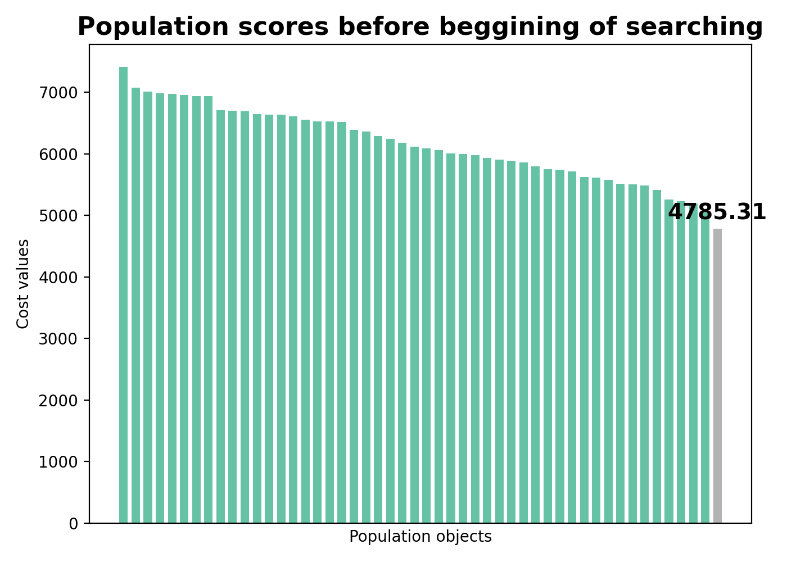
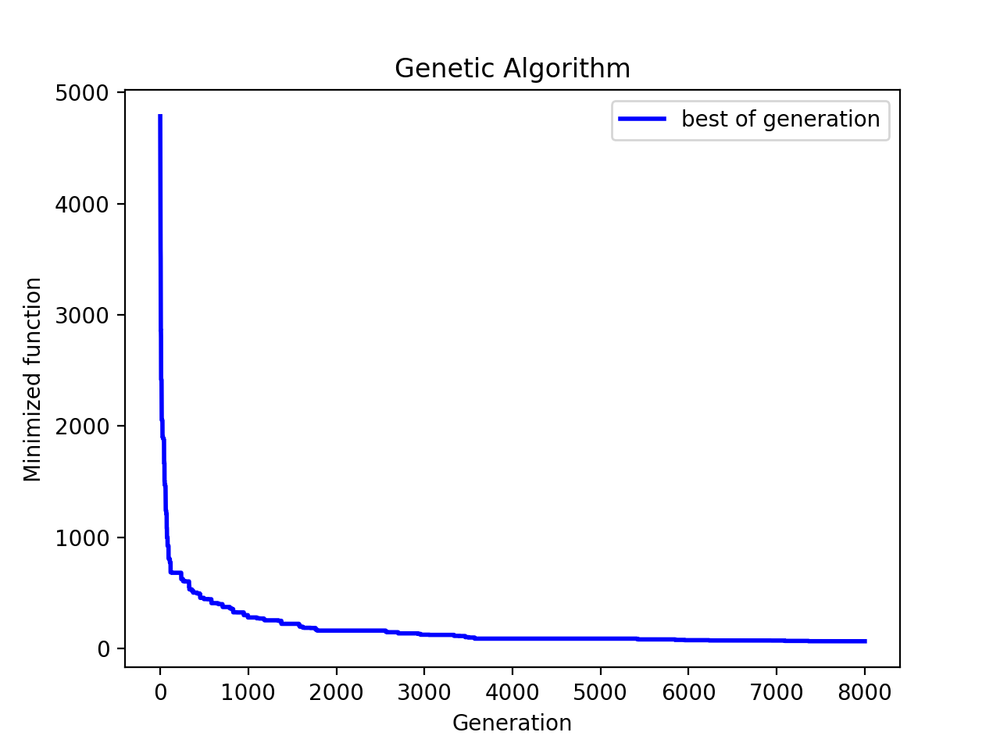
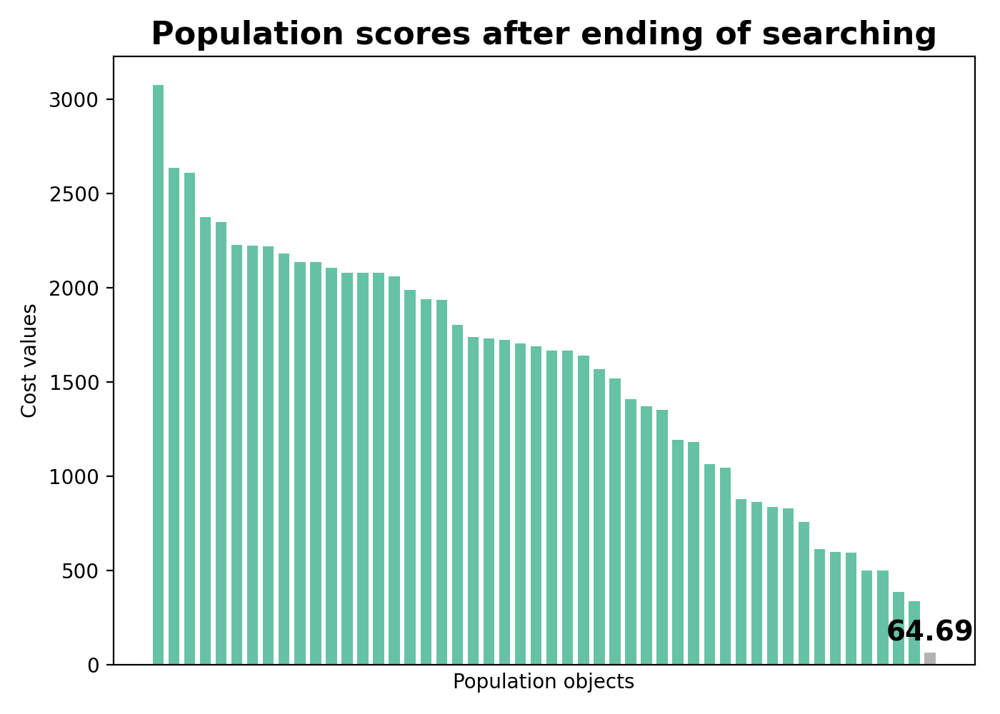


## How to specify evaluated function for all population?

U can do it using `set_function` parameter into `run()` method.

This function should get `numpy 2D-array` (samples x dimension) and return `1D-array` with results.

By default it uses `set_function = geneticalgorithm2.default_set_function(function)`, where

```python
    def default_set_function(function_for_set):
        def func(matrix):
            return np.array([function_for_set(matrix[i,:]) for i in range(matrix.shape[0])])
        return func
```
U may want to use it for creating some specific or fast-vectorized evaluations like here:

```python

def sigmoid(z):
    return 1/(1+np.exp(-z))

matrix = np.random.random((1000,100))

def vectorised(X):
    return sigmoid(matrix.dot(X))

model.run(set_function = vectorised)
```

## What about parallelism?

By using `set_function` u can determine your own behavior for parallelism or u can use `geneticalgorithm2.set_function_multiprocess(f, n_jobs = -1)` for using just parallelism (recommended for heavy functions and big populations, not recommended for fast functions and small populations).

For example:

```python
import numpy as np
from geneticalgorithm2 import GeneticAlgorithm2 as ga


def f(X):
    import math
    a = X[0]
    b = X[1]
    c = X[2]
    s = 0
    for i in range(10000):
        s += math.sin(a * i) + math.sin(b * i) + math.cos(c * i)

    return s


algorithm_param = {'max_num_iteration': 50,
                   'population_size': 100,
                   'mutation_probability': 0.1,
                   'elit_ratio': 0.01,
                   'parents_portion': 0.3,
                   'crossover_type': 'uniform',
                   'mutation_type': 'uniform_by_center',
                   'selection_type': 'roulette',
                   'max_iteration_without_improv': None}

varbound = np.array([[-10, 10]] * 3)

model = ga(function=f, dimension=3,
           variable_type='real',
           variable_boundaries=varbound,
           algorithm_parameters=algorithm_param)

########

%time
model.run()
# Wall time: 1min 52s

%time
model.run(set_function=ga.set_function_multiprocess(f, n_jobs=6))
# Wall time: 31.7 s
```

## How to initialize start population? How to continue optimization with new run?

For this there is `start_generation` parameter in `run()` method. It's the dictionary with structure like returned `model.output_dict['last_generation']`. Let's see example how can u to use it:

```python
import numpy as np
from geneticalgorithm2 import GeneticAlgorithm2 as ga


def f(X):
    return np.sum(X)


dim = 6

varbound = [(0, 10)] * dim

algorithm_param = {'max_num_iteration': 500,
                   'population_size': 100,
                   'mutation_probability': 0.1,
                   'elit_ratio': 0.01,
                   'parents_portion': 0.3,
                   'crossover_type': 'uniform',
                   'max_iteration_without_improv': None}

model = ga(function=f,
           dimension=dim,
           variable_type='real',
           variable_boundaries=varbound,
           algorithm_parameters=algorithm_param)

# start generation
# as u see u can use any values been valid for ur function
samples = np.random.uniform(0, 50, (300, dim))  # 300 is the new size of your generation

model.run(no_plot=False, start_generation={'variables': samples, 'scores': None})
# it's not necessary to evaluate scores before
# but u can do it if u have evaluated scores and don't wanna repeat calculations


# from version 6.3.0 it's recommended to use this form
from geneticalgorithm2 import Generation

model.run(no_plot=False, start_generation=Generation(variables=samples, scores=None))

# from version 6.4.0 u also can use these forms
model.run(no_plot=False, start_generation=samples)
model.run(no_plot=False, start_generation=(samples, None))

# if u have scores array, u can put it too
scores = np.array([f(sample) for sample in samples])
model.run(no_plot=False, start_generation=(samples, scores))

##
## after first run
## best value = 0.10426190111045064
##

# okay, let's continue optimization using saved last generation
model.run(no_plot=True, start_generation=model.output_dict['last_generation'])

##
## after second run
## best value = 0.06128462776296528
##

```

Also u can save and load populations using likely code:

```python
import numpy as np

from geneticalgorithm2 import GeneticAlgorithm2 as ga

from OptimizationTestFunctions import Eggholder

dim = 2 * 15

f = Eggholder(dim)

xmin, xmax, ymin, ymax = f.bounds

varbound = np.array([[xmin, xmax], [ymin, ymax]] * 15)

model = ga(function=f,
           dimension=dim,
           variable_type='real',
           variable_boundaries=varbound,
           algorithm_parameters={
               'max_num_iteration': 300,
               'population_size': 100
           })

# first run and save last generation to file
filename = "eggholder_lastgen.npz"
model.run(save_last_generation_as=filename)

# load start generation from file and run again (continue optimization)
model.run(start_generation=filename)
```


